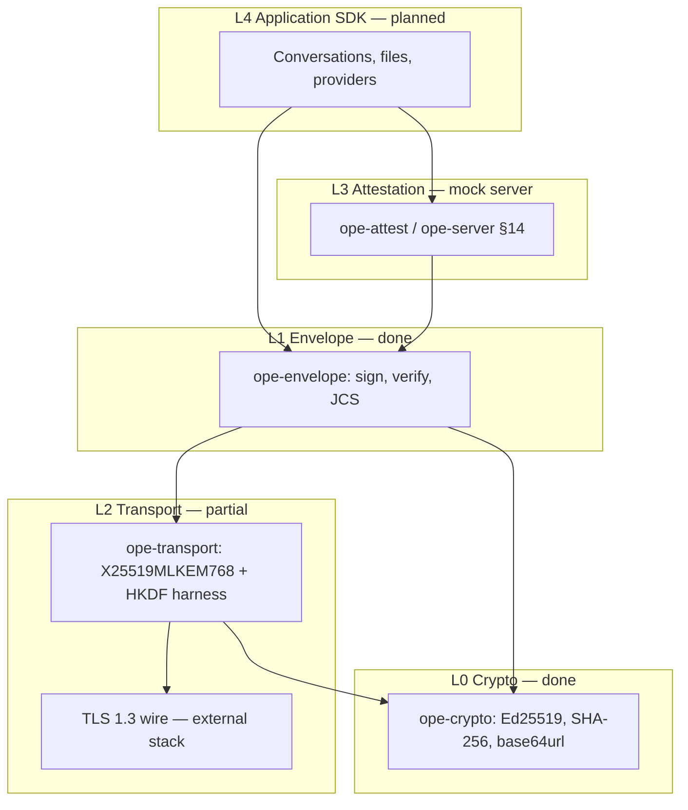

# OPE architecture

## Layer stack



| Layer | Crate | Spec | Implementation |
|-------|-------|------|----------------|
| L0 | `ope-crypto` | `ope.md` §5 | **Done** — Ed25519, SHA-256, base64url, `mock_keypair_from_seed` |
| L1 | `ope-envelope` | `ope.md` §4–8 | **Done** — JCS, sign/verify, encrypt/decrypt, replay/timestamp |
| L2 | `ope-transport` | `spec/ope-transport.md` | **Partial** — hybrid KEX + HKDF harness; wire TLS external |
| L2b | `ope-http` | `spec/ope-transport.md` §4 | **Done** — content types |
| L3 | `ope-attest` | `ope.md` §14 | **Done (mock)** — issue/verify + HTTP server |
| L3b | `ope-gateway` | Gateway routing | **Done (mock)** — verify + strip `model@provider` |
| L4 | `sdks/conversation` | App conventions | **Stub** — manifest types |
| FFI | `ope-ffi` | Stable C ABI | **Done** — envelope sign/verify |
| CLI | `ope-cli` | `spec/vectors/` | **Done** — `sign`, `verify`, `transport-test`, `keygen` |

## Repository layout

```text
OPE/
├── ope.md                      # Normative protocol
├── spec/
│   ├── ope-transport.md        # Transport profile
│   └── vectors/*.json          # Interop vectors
├── crates/
│   ├── ope-crypto/
│   ├── ope-envelope/
│   ├── ope-transport/
│   ├── ope-attest/
│   ├── ope-ffi/
│   └── ope-cli/
├── bindings/                   # planned
├── docs/
│   ├── ARCHITECTURE.md         # this file
│   └── ROADMAP.md
├── .github/workflows/ci.yml
└── rust-toolchain.toml         # stable
```

## Cryptographic separation

| Purpose | Algorithms | Where stored |
|---------|------------|--------------|
| Envelope integrity / sender auth | Ed25519 (`kid`) | Client key store; `sig` on wire |
| Payload digest | SHA-256 → base64url `payload_hash` | Envelope |
| Optional payload confidentiality | XChaCha20-Poly1305 or AES-GCM (`enc` field) | Envelope (`ciphertext`, `iv`) |
| Channel confidentiality | TLS 1.3 + `X25519MLKEM768` → HKDF → AES-GCM records | Session (not the `kid` key) |

**Rule:** Never use the envelope Ed25519 key as a TLS certificate or hybrid KEX identity.

## Envelope verify pipeline (`ope-envelope`)

1. Structural validation (`ope_version`, `alg`, `enc`, required fields).
2. Timestamp within skew (`VerifyOptions::max_skew`, default ±300s).
3. Optional replay cache on `(kid, nonce)`.
4. Recompute `payload_hash` over canonical JCS payload bytes.
5. Verify Ed25519 signature over canonical JCS signed-field object (§5).

Signed fields: `ope_version`, `alg`, `enc`, `kid`, `recipient`, `ts`, `nonce`, `payload_hash`, plus `ciphertext`, `iv`, `aad` when present.

## Transport pipeline (`ope-transport`)

Implements [draft-ietf-tls-ecdhe-mlkem](https://datatracker.ietf.org/doc/draft-ietf-tls-ecdhe-mlkem/) **shared secret** construction for `X25519MLKEM768`:

- Client share (1216 B): `ML-KEM-768 encapsulation key || X25519 public`
- Server share (1120 B): `ML-KEM ciphertext || X25519 public`
- Shared secret (64 B): `ML-KEM_ss || X25519_ss`

Production stacks should feed this secret into the TLS 1.3 key schedule ([RFC 8446](https://www.rfc-editor.org/rfc/rfc8446)). The in-repo harness runs KEX without TLS for CI (`ope transport-test`).

## Interoperability

- **Vectors:** `spec/vectors/*.json` — language bindings must pass the same files as `cargo test` / `ope verify`.
- **CI:** GitHub Actions signs `001` then runs `cargo test --all`.

## Design rules

1. **Rust is the reference implementation** for cryptography and canonicalization.
2. **One crypto core** — other languages bind `ope-ffi` or re-run vectors; no duplicated primitive logic.
3. **Interop via vectors** — spec changes require new vector files before release.
