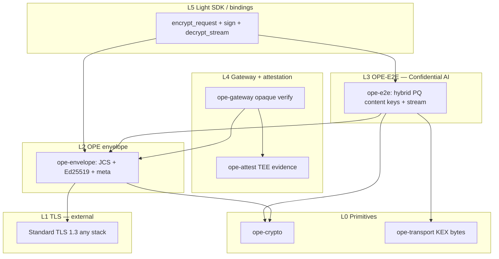

# OPE architecture

OPE is the **privacy layer for Confidential AI**: signed envelopes on standard TLS, with **application-layer E2E** encryption to inference TEEs the gateway cannot read.

See [`docs/confidential-ai.md`](confidential-ai.md) and [`spec/ope-confidential-ai.md`](../spec/ope-confidential-ai.md).

## Trust model

```text
Client ──TLS 1.3 (unchanged)──► Gateway (TDX/SEV) ──► Inference engine (TDX/SEV + GPU TEE)
         OPE signed envelope          meta only              decrypt / infer / encrypt stream
         enc=e2e-hybrid-pq            opaque forward
```

| Component | Sees prompt/context? | Crypto role |
|-----------|----------------------|-------------|
| Client | Yes (before encrypt) | User Ed25519 `kid`; ephemeral hybrid per request |
| Gateway | **No** (opaque `ciphertext`) | Verify `sig`, attestation, `meta`; meter/route |
| Inference engine | Yes | Static ML-KEM + X25519; decrypt request; stream-encrypt response |

## Layer stack



| Layer | Crate | Spec | Status |
|-------|-------|------|--------|
| L0 | `ope-crypto`, `ope-transport` | §5, transport | Done |
| L2 | `ope-envelope` | `ope.md` §4–8 | Done + `e2e-hybrid-pq` fields |
| L3 | **`ope-e2e`** | `spec/ope-confidential-ai.md` | **Reference** (mock engine) |
| L1 | TLS | — | **External** (no OPE fork) |
| L4 | `ope-gateway`, `ope-attest`, `ope-server` | §14, confidential-ai | Gateway opaque mode done |
| L5 | `ope-ffi`, `bindings/*` | — | Envelope + hybrid E2E (`ope_e2e_*`) C ABI; WASM planned |

`ope-transport` provides **X25519MLKEM768** math shared with TLS PQ drafts; production TLS uses s2n/BoringSSL directly. **Application E2E** uses `ope-e2e` HKDF labels, not TLS record keys.

## Cryptographic separation

| Purpose | Algorithms | Holder |
|---------|------------|--------|
| Envelope integrity / user auth | Ed25519 (`kid`) | Client |
| Gateway policy | Attestation + `meta` | Gateway TEE |
| Request confidentiality | ML-KEM-768 + X25519 → ChaCha20-Poly1305 (`enc=e2e-hybrid-pq`) | **Inference engine only** |
| Response confidentiality | Ephemeral hybrid + `chacha20poly1305-stream` | Client ephemeral session |
| Wire channel | TLS 1.3 (optional PQ) | Any TLS terminator |

**Rules:**

1. Never use envelope `kid` Ed25519 keys for hybrid KEX.
2. Gateway MUST NOT hold engine ML-KEM decapsulation keys in production.
3. Do not derive OPE content keys from TLS session secrets.

## Envelope verify (gateway)

1. Structural validation (`enc=e2e-hybrid-pq` requires `engine_id`, `e2e`).
2. Timestamp + nonce replay.
3. Ed25519 signature (includes `engine_id`, `e2e` when present).
4. **`opaque_e2e: true`** — skip decrypt; validate routing via `meta.model` if required.
5. Attestation + policy.

## Envelope verify (inference engine)

Same as gateway for signature/freshness, then `ope_e2e::decrypt_request`, verify `payload_hash`, run model.

## Interoperability

- Legacy vectors `001`–`008`: gateway-local `enc=xchacha20poly1305` / `none`.
- Confidential AI vectors: `spec/vectors/confidential-ai/` (planned).
- CI: `cargo test --all`, `ope e2e-test`.

## Design rules

1. **Rust reference** for canonicalization and E2E math.
2. **Standard TLS** for third-party HTTP integration.
3. **Thin SDK** — wrap/unwrapping without forking TLS.
