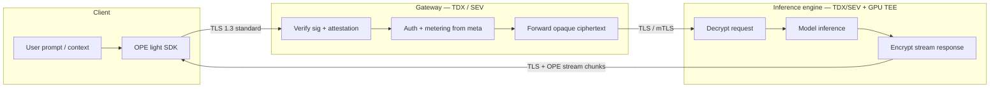
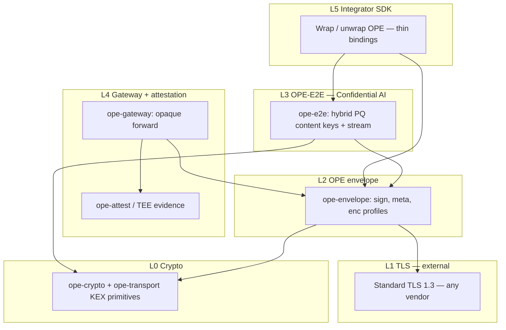

# Confidential AI architecture (OPE)

OPE is the **privacy layer** for Confidential AI: application-level E2E encryption and signed envelopes on top of **unchanged TLS**.

## System diagram

## Roles and visibility

| Component | Enclave | Request plaintext | Response plaintext | Keys |
|-----------|---------|-------------------|--------------------|------|
| Client | — | Yes (local) | Yes (after decrypt) | User Ed25519 `kid`; **ephemeral** hybrid per request |
| Gateway | TDX / SEV | **No** | **No** | Gateway verify keys; **no** engine decaps key |
| Inference engine | TDX/SEV + GPU TEE | Yes | Yes | **Static** hybrid + Ed25519; response uses request ephemeral |

## Layer stack (reworked)

| Layer | Crate | Purpose |
|-------|-------|---------|
| L0 | `ope-crypto`, `ope-transport` | Ed25519, SHA-256, ML-KEM + X25519 KEX bytes |
| L1 | `ope-envelope` | Signed envelope, `meta`, routing |
| L2 | **TLS (external)** | Wire confidentiality — **not forked by OPE** |
| L3 | **`ope-e2e`** | PQ hybrid content encryption to engine / from engine |
| L4 | `ope-gateway`, `ope-attest` | Policy on metadata; TEE attestation |
| L5 | `bindings/*`, `ope-ffi` | Thin client libraries |

`ope-transport` remains for **TLS-aligned KEX test vectors** and optional PQ TLS; it is **not** the Confidential AI application encryption layer.

## Request flow

1. Client loads engine registry entry: `engine_id`, ML-KEM encap key, X25519 public, Ed25519 public (from attestation).
2. Client builds OpenAI-compatible JSON payload; computes `payload_hash`.
3. Client runs `X25519MLKEM768` as **request** direction: ephemeral `client_share` → content key via HKDF (`direction=request`).
4. Client AEAD-encrypts payload (`chacha20poly1305`), sets `enc=e2e-hybrid-pq`, fills `e2e` + `meta` (model, tenant, metering).
5. Client signs envelope (Ed25519 `kid`).
6. POST over **normal TLS** to gateway.
7. Gateway verifies signature, timestamp, nonce, attestation; reads **`meta` only**; routes to `engine_id`; forwards body unchanged.
8. Engine derives same content key (static decaps + X25519), decrypts, verifies `payload_hash`, runs inference.

## Response flow (streaming)

1. Engine derives **response** direction key from client’s `client_share` + fresh `server_share` in response `e2e`.
2. Engine emits `chacha20poly1305-stream` chunks (`seq`, `ciphertext`, `final`).
3. Client decrypts incrementally with ephemeral secret from step 3 of request flow.

AES-GCM is acceptable for **non-streaming** responses; **ChaCha20-Poly1305 stream** is preferred for token streams (arbitrary chunk sizes, no 16-byte block alignment issues).

## Key separation (normative)

| Key material | Purpose | MUST NOT |
|--------------|---------|----------|
| User Ed25519 (`kid`) | Envelope integrity + sender auth | Encrypt payload to engine |
| Engine Ed25519 | TEE / registry identity | TLS client cert |
| Engine ML-KEM + X25519 static | Decrypt requests | Live on gateway |
| Client ephemeral hybrid | Response decryption | Reused across requests |
| TLS session keys | Channel encryption | Replace OPE-E2E content keys |

## Third-party integration

- **No custom TLS:** Use existing HTTPS clients and load balancers.
- **Minimal SDK:** `encrypt_request` + `sign_envelope` + `decrypt_stream_chunk` (see `ope-e2e` API).
- **Gateway vendors:** Verify OPE + attestation; implement metering on `meta`; never log `ciphertext`.

## Implementation status

| Item | Status |
|------|--------|
| Spec [`spec/ope-confidential-ai.md`](../spec/ope-confidential-ai.md) | Draft |
| `ope-e2e` crate | Reference (dev mock engine keys) |
| `enc=e2e-hybrid-pq` in `ope-envelope` | Structure + gateway opaque mode |
| TEE attestation binding real engine keys | Planned |
| FFI for E2E (`ope_e2e_*` hybrid request/response C ABI) | Done — see [`bindings/README.md`](../bindings/README.md) |
| Higher-level binding wrappers (per language) | Partial (Node koffi wrapper in consumer; others planned) |
| Published vectors `spec/vectors/confidential-ai/` | Planned |

See [`docs/ROADMAP.md`](ROADMAP.md) for phases.
